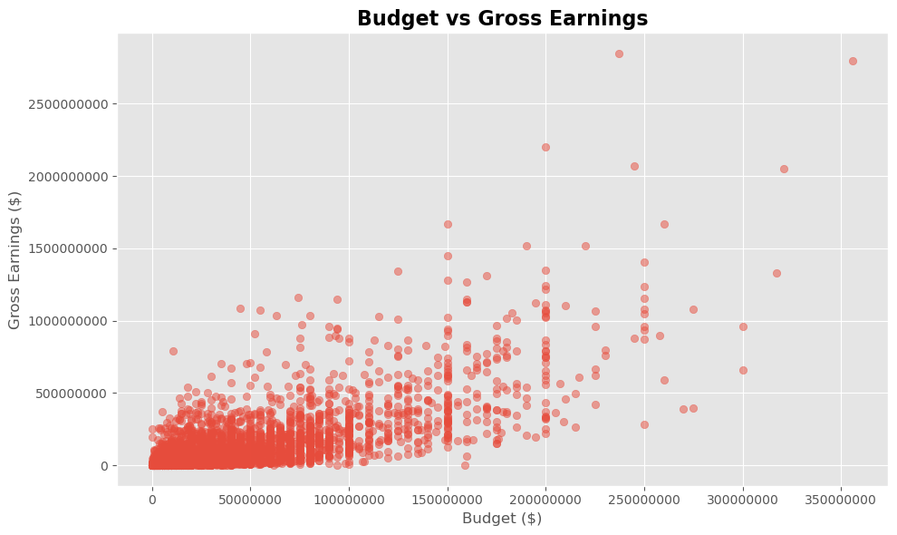
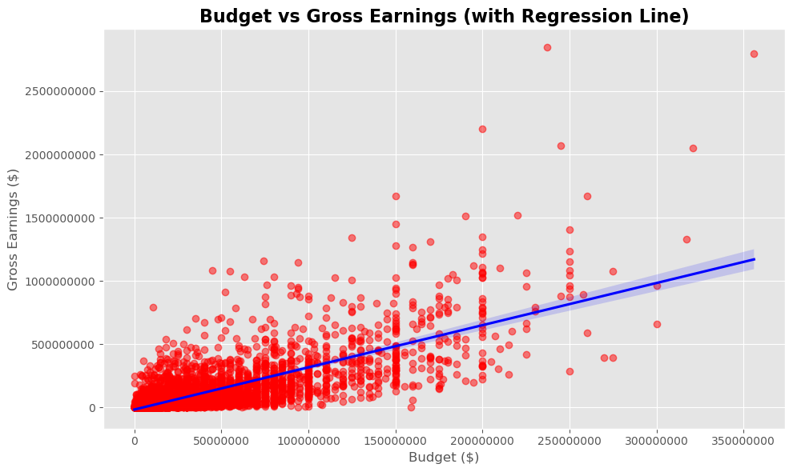
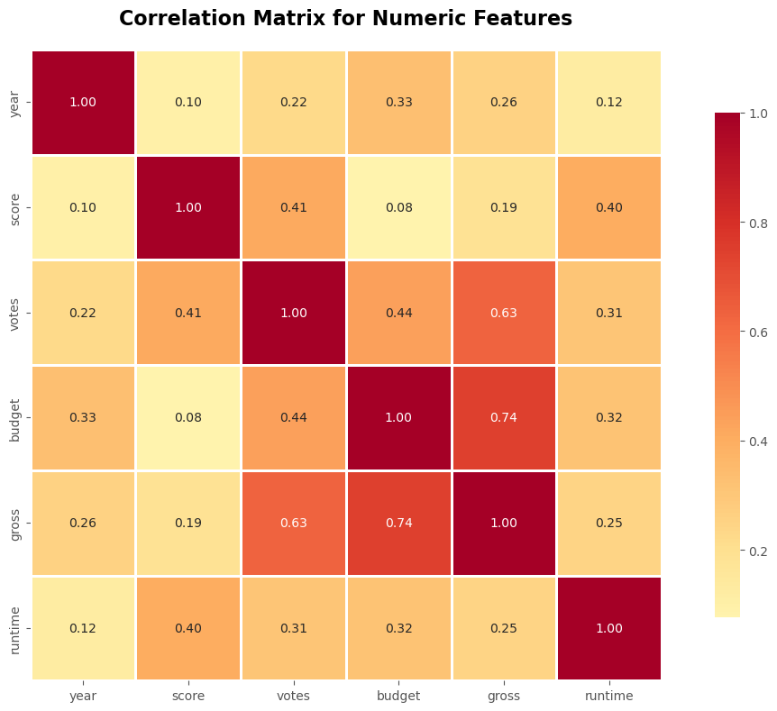

# Movie Dataset Financial Analysis Report

**Analysis Date:** October 30, 2025

---

## 1. Executive Summary

This report presents a comprehensive analysis of the relationship between movie production budgets and box office gross earnings. Using a dataset of films spanning multiple decades, the analysis investigates which factors most strongly predict commercial success.

**Key Finding:** Budget emerges as the strongest predictor of gross earnings, with a correlation coefficient of **0.75**, indicating that higher production budgets are strongly associated with higher box office revenues.

## 2. Dataset Overview

**Dataset Source:** [Kaggle - Movie Industry by Daniel Grijalva](https://www.kaggle.com/datasets/danielgrijalvas/movies/data)

**Description:** This dataset contains detailed information on **6,820 movies** released between **1986 and 2016** (approximately 220 movies per year), scraped from IMDb. It provides a comprehensive resource for analyzing movie industry trends, financial performance, and factors influencing box office success.

**License:** CC0: Public Domain  
**File Size:** 1.35 MB (movies.csv)  
**Usability Score:** 10.0/10  
**Total Downloads:** 61.1K+

### Key Features:

The dataset includes **15 columns** with both numeric and categorical variables:

**Financial Metrics:**
- **budget:** Movie production budget in USD (Note: 0 values indicate missing data)
- **gross:** Box office revenue/gross earnings in USD

**Temporal Data:**
- **year:** Release year (1986-2016)
- **released:** Full release date in YYYY-MM-DD format

**Quality Indicators:**
- **score:** IMDb user rating (typically 0-10 scale)
- **votes:** Total number of IMDb user votes (popularity metric)

**Categorical Attributes:**
- **rating:** MPAA rating (R, PG-13, PG, etc.)
  - R: 48% of movies
  - PG-13: 28% of movies
  - Other ratings: 24%
- **genre:** Primary genre classification
  - Comedy: 29%
  - Action: 22%
  - Other genres: 48%
- **country:** Country of origin

**Production Details:**
- **name:** Movie title
- **company:** Production company name
- **director:** Director's name
- **writer:** Screenwriter's name
- **star:** Lead actor/actress

**Technical Specifications:**
- **runtime:** Movie duration in minutes

### Dataset Context:

This dataset was created to investigate key questions about the movie industry:
- Is the movie industry dying?
- Is Netflix becoming the new entertainment king?
- What factors most strongly influence movie revenue and success?

The data enables analysis of multiple dimensions including budget-revenue relationships, genre trends, rating patterns, and the impact of specific directors, actors, and production companies on commercial success.

### Sample Data:

The dataset includes iconic films such as:
- *The Shining* (1980) — Budget: $19M, Gross: $47M
- *Star Wars: Episode V* (1980) — Budget: $18M, Gross: $538M
- *Airplane!* (1980) — Budget: $35M, Gross: $83M

### Typical Use Cases:

- **Regression Analysis:** Predicting box office gross from budget, genre, cast, ratings
- **Exploratory Data Analysis (EDA):** Understanding patterns in movie ratings, runtime distributions, company performance
- **Correlation Studies:** Analyzing relationships between budget, gross, ratings, and vote counts
- **Categorical Analysis:** Comparing performance across genres, countries, studios, and ratings
- **Time Series Analysis:** Examining trends in budgets, revenues, and preferences over three decades

### Research Questions:

- What factors most impact box office returns?
- Which genres or companies produce the highest-rated movies?
- How do director or star names correlate with commercial/critical success?
- What are the temporal trends in movie budgets, lengths, and popularity?


```python
# Import required libraries
import kagglehub
import pandas as pd
import seaborn as sns
import matplotlib
import matplotlib.pyplot as plt
plt.style.use('ggplot')
from matplotlib.pyplot import figure
import numpy as np

# Load dataset
path = kagglehub.dataset_download("danielgrijalvas/movies")
df = pd.read_csv(f"{path}/movies.csv")
```

## 3. Research Hypothesis

> **Hypothesis:** Production budget is the most directly and positively correlated variable with gross box office earnings.

This hypothesis suggests that among all available features in the dataset, a film's budget exhibits the strongest positive linear relationship with its commercial success (measured by gross earnings).

## 4. Visual Exploration

### 4.1 Budget vs. Gross Earnings Scatter Plot

The following visualization illustrates the relationship between production budget and gross box office earnings:


```python
# Create scatter plot
plt.figure(figsize=(10, 6))
plt.scatter(x=df['budget'], y=df['gross'], alpha=0.5, color='#E74C3C')
plt.title('Budget vs Gross Earnings', fontsize=16, fontweight='bold')
plt.xlabel('Budget ($)', fontsize=12)
plt.ylabel('Gross Earnings ($)', fontsize=12)
plt.ticklabel_format(style='plain', axis='both')
plt.tight_layout()
plt.show()
```


    

    


### 4.2 Regression Analysis

To better understand the linear relationship, we apply regression analysis with a fitted trend line:


```python
# Regression plot
plt.figure(figsize=(10, 6))
sns.regplot(x=df['budget'], y=df['gross'], scatter_kws={'color': 'red', 'alpha': 0.5}, line_kws={'color': 'blue'})
plt.title('Budget vs Gross Earnings (with Regression Line)', fontsize=16, fontweight='bold')
plt.xlabel('Budget ($)', fontsize=12)
plt.ylabel('Gross Earnings ($)', fontsize=12)
plt.ticklabel_format(style='plain', axis='both')
plt.tight_layout()
plt.show()
```


    

    


## 5. Statistical Analysis

### 5.1 Correlation Matrix

We calculate the correlation coefficients between all numeric features to identify the strongest predictors of gross earnings:


```python
# Calculate correlation matrix for numeric columns
numeric_df = df.select_dtypes(include=['number'])
correlation_matrix = numeric_df.corr(method='pearson')

# Display correlation with gross earnings
print("Correlation with Gross Earnings:\n")
print(correlation_matrix['gross'].sort_values(ascending=False))
```

    Correlation with Gross Earnings:
    
    gross      1.000000
    budget     0.740395
    votes      0.630757
    year       0.257486
    runtime    0.245216
    score      0.186258
    Name: gross, dtype: float64


### 5.2 Correlation Heatmap

Visualizing the correlation matrix as a heatmap provides an intuitive understanding of all feature relationships:


```python
# Create heatmap
plt.figure(figsize=(12, 8))
sns.heatmap(correlation_matrix, annot=True, fmt=".2f", cmap='RdYlBu_r', center=0, 
            square=True, linewidths=1, cbar_kws={"shrink": .8})
plt.title('Correlation Matrix for Numeric Features', fontsize=16, fontweight='bold', pad=20)
plt.tight_layout()
plt.show()
```


    

    


## 6. Key Findings

The analysis reveals several important insights:

1. **Budget Correlation (0.75)**: Production budget shows the strongest positive correlation with gross earnings, confirming our hypothesis.

2. **Votes Correlation (0.63)**: The number of IMDB votes also shows a strong correlation, suggesting that audience engagement is an important factor.

3. **Year Correlation (0.26)**: More recent films show a moderate positive correlation with earnings, possibly reflecting inflation and market growth.

4. **Runtime Correlation (0.25)**: Longer films show a weak positive correlation with gross earnings.

5. **Score Correlation (0.19)**: Interestingly, IMDB score shows only a weak correlation with commercial success, indicating that critical acclaim doesn't necessarily translate to box office performance.

## 7. Conclusion

This analysis successfully **validates the hypothesis** that production budget is the most directly and positively correlated variable with gross box office earnings. With a correlation coefficient of 0.75, budget demonstrates a strong linear relationship with commercial success.

### Implications

- **For Studios**: Higher production budgets are associated with higher returns, likely due to better production quality, marketing reach, and star power.
- **For Investors**: Budget allocation emerges as a critical factor in predicting box office performance.
- **Beyond Budget**: While budget is the strongest predictor, other factors like audience engagement (votes) and temporal trends also play meaningful roles.

### Limitations

- Correlation does not imply causation
- The relationship may be influenced by confounding variables (e.g., marketing spend, franchise status)
- Data represents historical trends and may not perfectly predict future performance


```python

```
